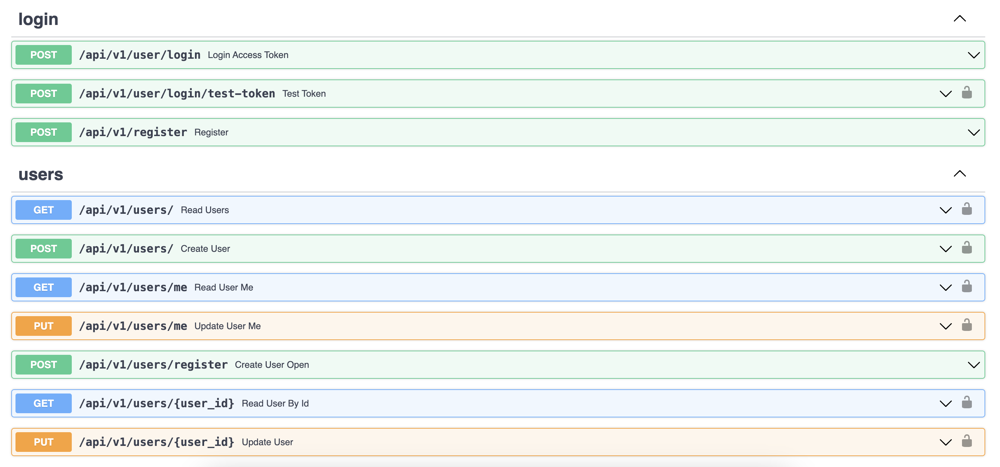
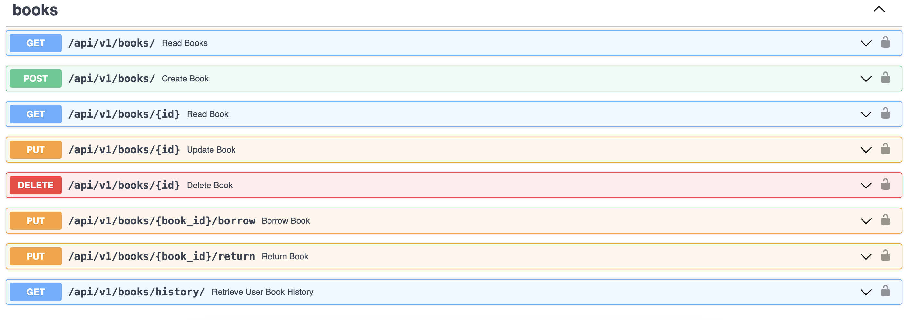

# BookInventory

## REST APIs for Book Inventory using FastAPI





## Backend Requirements

* [Docker](https://www.docker.com/).
* [Docker Compose](https://docs.docker.com/compose/install/).
* [Poetry](https://python-poetry.org/) for Python package and environment management.

## Backend local development

* Start the stack with Docker Compose:

```bash
docker-compose up -d
```

* Now you can open your browser and interact with these URLs:

Frontend, built with Docker, with routes handled based on the path: http://localhost

Backend, JSON based web API based on OpenAPI: http://localhost/api/

Automatic interactive documentation with Swagger UI (from the OpenAPI backend): http://localhost/docs

Alternative automatic documentation with ReDoc (from the OpenAPI backend): http://localhost/redoc

PGAdmin, PostgreSQL web administration: http://localhost:5050

Traefik UI, to see how the routes are being handled by the proxy: http://localhost:8090

**Note**: The first time you start your stack, it might take a minute for it to be ready. While the backend waits for the database to be ready and configures everything. You can check the logs to monitor it.

To check the logs, run:

```bash
docker-compose logs
```

To check the logs of a specific service, add the name of the service, e.g.:

```bash
docker-compose logs backend
```

> Note : This project is created with the help of [tiangolo/full-stack-fastapi-postgresql](https://github.com/tiangolo/full-stack-fastapi-postgresql) and modified accordingly, due to limited time. It still contains bugs, and not 100% ready.
